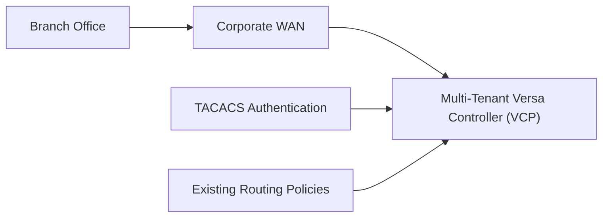

# Legacy Architecture

## Overview

This directory documents the simulated legacy environment used in the VCP-to-AWS migration project.

The environment represents an enterprise SD-WAN deployment in which branch connectivity, centralized management, authentication, and routing policies are handled through an on-premises Versa Controller Platform, or VCP.

Before the migration, the VCP acts as the central control point for the branch network. It maintains communication with the branch office, applies routing policies, supports administrative authentication through TACACS, and connects the branch environment to the corporate WAN.

This architecture provides the baseline state against which the AWS migration is planned, validated, and tested.

## Purpose

The purpose of this legacy architecture is to simulate the type of environment that would exist before a real controller migration begins.

It helps demonstrate:

* How the branch communicates with the existing VCP
* Which services depend on the controller
* Which configurations must be preserved during migration
* Where authentication and routing dependencies exist
* What must remain operational after the controller is moved to AWS

The migration is not limited to provisioning a new controller in AWS. The real objective is to preserve the operational behaviour of the existing environment while transferring management services to the cloud.

## Components

### Multi-Tenant Versa Controller

The Versa Controller Platform is the central management component in the legacy environment.

It is responsible for:

* Managing branch connectivity
* Maintaining controller-to-branch communication
* Applying routing and network policies
* Supporting branch onboarding
* Providing centralized operational control
* Managing multiple logical tenants within the same platform

Because this is a multi-tenant controller, changes must be carefully planned to avoid affecting unrelated branches or tenant environments.

### Branch Office

The branch office represents the remote site connected to the corporate network through the SD-WAN environment.

The branch depends on the controller for centralized management and policy coordination.

During migration, branch connectivity must remain stable. Any interruption in communication between the branch and the controller may result in onboarding failure, loss of management visibility, or the need to reschedule the migration.

### Corporate WAN

The corporate WAN provides the network path between the branch office and the legacy controller environment.

It represents the wider enterprise network through which branch traffic and management communication flow.

The migration must preserve the existing connectivity path or provide an equivalent path to the new AWS-hosted controller.

### TACACS Authentication

TACACS provides centralized authentication and authorization for administrative access.

It allows user access to network infrastructure to be controlled through centralized credentials and policies.

During migration, TACACS connectivity must be validated to ensure administrators can continue to authenticate to the controller after it is deployed in AWS.

### Existing Routing Policies

Routing policies define how branch and management traffic move through the environment.

These policies may include:

* Static routes
* Dynamic routing behaviour
* Preferred network paths
* Failover routes
* Management traffic rules
* Branch-specific routing requirements

The migration must ensure that these policies are either preserved or recreated correctly in AWS.

## Migration Objective

The objective of the project is to migrate controller management services from the on-premises Versa Controller Platform to AWS while preserving branch connectivity and existing operational behaviour.

The migration should achieve the following outcomes:

* Deploy the replacement controller environment in AWS
* Preserve branch-to-controller communication
* Maintain TACACS authentication
* Retain existing routing behaviour
* Validate controller reachability
* Confirm branch onboarding
* Verify post-migration connectivity
* Minimize disruption to the branch
* Provide a clear reschedule or rollback path if validation fails

A successful migration is not defined only by the availability of the AWS infrastructure. It is successful only when the branch can communicate with the new controller and all required operational checks pass.

## Legacy Architecture Flow



## Current-State Traffic Flow

The branch office communicates through the corporate WAN to reach the on-premises VCP.

The controller uses the existing routing policies to determine how management and branch traffic should flow.

Administrative authentication is provided through TACACS.

The simplified flow is:

```text
Branch Office
      |
      v
Corporate WAN
      |
      v
On-Premises Versa Controller
      |
      +--> TACACS Authentication
      |
      +--> Existing Routing Policies
```

## Migration Considerations

Several dependencies must be reviewed before moving the controller to AWS.

### Connectivity

The new AWS controller must be reachable from the branch office and the corporate WAN.

Security groups, routing tables, network ACLs, load balancer configuration, and any required VPN or private connectivity must support the same communication paths as the legacy environment.

### Authentication

TACACS access must remain available after migration.

A controller that is reachable but cannot authenticate administrators should not be considered fully operational.

### Routing

Existing routing behaviour must be reviewed before migration and validated afterwards.

Any missing or incorrect route may cause the branch to become unreachable even if the AWS controller itself is healthy.

### Branch Onboarding

After the AWS controller becomes available, the branch must be onboarded or re-associated with the new controller.

The migration cannot be considered complete until the branch successfully registers and passes connectivity validation.

### Validation

Post-migration checks should confirm:

* Controller reachability
* Load balancer target health
* Branch registration
* Branch connectivity
* TACACS authentication
* Routing policy availability
* Monitoring and alarm status
* Application and service health

## Failure Scenarios

The migration may require rescheduling if the branch cannot be reached or if console access is unavailable.

A migration may require rollback if changes have already been applied and the AWS environment cannot support stable branch connectivity.

Typical outcomes include:

* **Success** — the controller is reachable and the branch is operational
* **Reschedule** — migration cannot proceed because prerequisites or branch access are unavailable
* **Rollback** — migration changes were applied but must be reversed
* **Partial completion** — some migration activities succeeded, but one or more branches remain incomplete

For a single-branch migration, partial completion is generally not applicable because the branch is either successfully migrated or it is not.

## Relationship to the AWS Architecture

This legacy architecture serves as the source environment for the AWS migration.

The target architecture introduces:

* AWS networking
* Private controller compute
* Application Load Balancer
* Security groups
* IAM and Systems Manager access
* CloudWatch monitoring
* Migration automation
* Branch onboarding validation
* Incident and rollback procedures

The target AWS design should reproduce the required operational capabilities of the legacy environment while improving automation, observability, recoverability, and infrastructure consistency.

## Summary

The legacy environment represents the operational starting point of the migration.

It includes a branch office, corporate WAN, multi-tenant Versa Controller, TACACS authentication, and existing routing policies.

The migration must preserve these dependencies while moving controller services to AWS.

The primary success criterion is not simply that the AWS controller is deployed.

The migration is complete only when the branch remains connected, authentication works, routing behaviour is preserved, and all post-migration validation checks pass.
