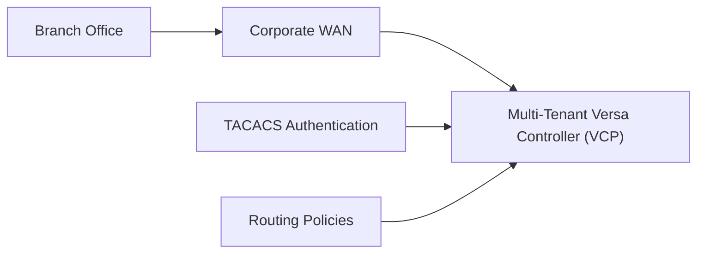

# Legacy Architecture

## Overview

This repository simulates an enterprise SD-WAN environment before migration to AWS. The architecture represents a typical on-premises Versa Controller Platform (VCP) managing branch connectivity, authentication, and routing policies.

## Architecture Diagram

## Components

| Component | Purpose |
|-----------|---------|
| Branch Office | Enterprise branch connected to the SD-WAN fabric |
| Corporate WAN | Transport network connecting branches to the controller |
| Versa Controller Platform (VCP) | Centralized management and orchestration platform |
| TACACS | Centralized administrator authentication |
| Routing Policies | Existing SD-WAN routing configuration |

## Objective

Migrate management services from the on-premises Versa Controller Platform (VCP) to AWS while preserving branch connectivity and operational consistency.
